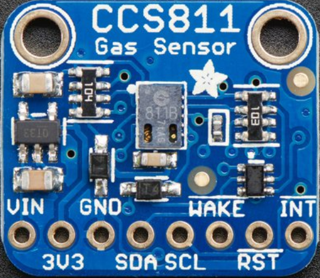
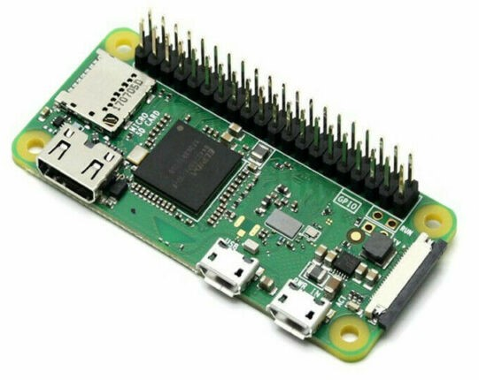
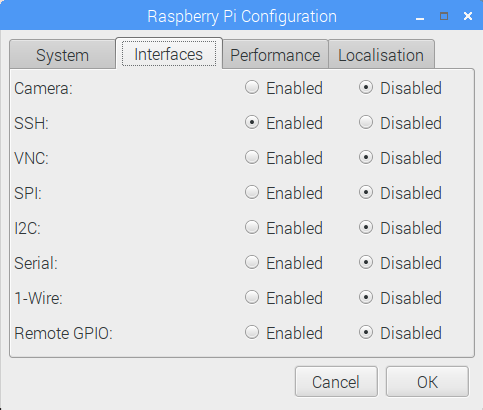

# CO2-TVOC

<b>You can monitor CO2 and TVOC using a Raspberry Pi and an Adafruit CCS811 gas sensor.</b> TVOC stands for Total Volatile Organic Compounds. This sensor measures CO2 in PPM (parts per million) and TVOCs in PPB (parts per billion).


## <a  href="https://www.adafruit.com/product/3566?gclid=CjwKCAjw4NrpBRBsEiwAUcLcDC7rfEBlaclDQMmAmDsiB-NlT1wL61pWEKSJDLwR02b2QgCL3pEg2RoCNKAQAvD_BwE">CO2-TVOC Sensor<br>
</a>

## <a href="https://thepihut.com/collections/raspberry-pi/products/raspberry-pi-zero-w">Raspberry Pi Zero W

<br>The Raspberry Pi Mega Kit includes a Raspberry Pi Zero W</a> with GPIO header attached plus a 16GB MicroSD memory card with the Raspbian operating system installed.  You can use your own memory card and <a href="https://www.raspberrypi.org/downloads/raspbian/">download and install Raspbian</a> 

## Interacting with Raspberry Pi Zero W

To connect directly to your Raspberry Pi Zero W, you will need a miniHDMI-to-HDMI adaptor and a microUSB-to-USB adaptor.  Power Raspberry Pi with a wall plug or a USB battery capable of powering mobile phones.

You can connect remotely using Secure Shell (SSH).  First, you must enable SSH.  Click the  raspberry icon on the menu.  Select ```Preferences```, then select ```Raspberry Pi Configuration```.  Click the ```Interfaces``` tab and enable ```SSH```.  




## Building your device

Use this [tutorial](https://learn.adafruit.com/adafruit-ccs811-air-quality-sensor/raspberry-pi-wiring-test) to build your device


## Verifying the version of Python

The Raspbian operating system comes with two versions of Python pre-installed.  This tutorial uses Python 2 and Python 3.  Verify that these versions are installed:

```
python --version
$ Python 2.7.16
```

Verify that Python3 has been pre-installed:

```
python3 --version
$ Python 3.7.3
```

```
pip3 --version
$  pip 18.1 from /usr/lib/python3/dist-packages/pip (python 3.7)
```

## Investigating patterns in your data

Plotting CO2 and TVOC data over time shows how air quality may change.  Use this data science notebook to get started [investigating patterns in CO2-TVOC data](https://www.kaggle.com/nelsondata/los-angeles-air-quality)

[Charting CO2 data on ThingSpeak](https://thingspeak.com/channels/865249)

## Learning as we go

- Raspberry Pi Buster operating system appears to have a WiFi Bug.  You may want to use Stretch until a solution is found.  Learn more:
https://www.raspberrypi.org/forums/viewtopic.php?t=252984

